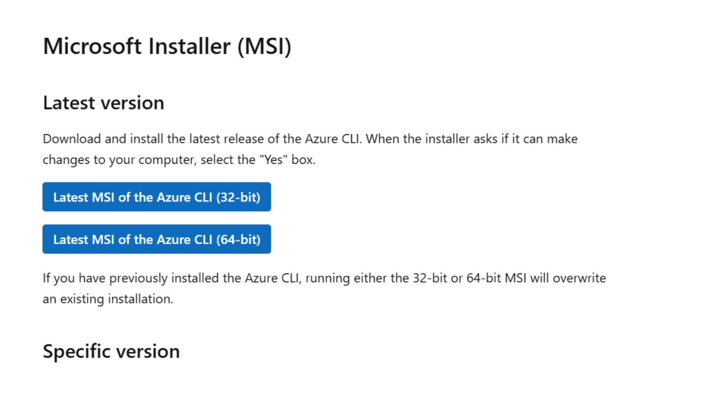
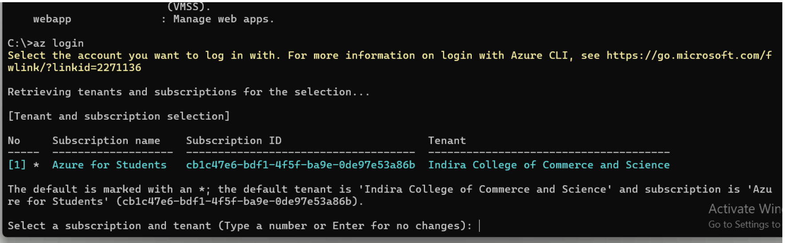

# How to Deploy a Docker Container to Azure 🚀

This guide explains how to containerize an application using Docker and deploy it to **Microsoft Azure** using **Azure Container Registry (ACR)** and **Azure Container Instances (ACI)**.

## Prerequisites

Make sure you have the following installed and ready:

- Docker
- Azure CLI
- An Azure account
- A working application (Node.js / Java / Python / etc.)

---
## How to install Azure CLI to Windows 
Visit <a href="https://learn.microsoft.com/en-us/cli/azure/install-azure-cli-windows?view=azure-cli-latest&pivots=msi"> this site </a>and install Azure CLI

 

After installation, close and reopen any active terminal window. Run the Azure CLI with the az command from either PowerShell or the Windows Command Prompt.

1. Now login to your Azure with Azure CLI <b>with command</b> 

    `AZ login`

It will take you to one interactive window to login to your Azure account - use the email which is your primary email account for azure. 

After Successful login you will get out put as follows 

2. Now you can check your account details by using below command. 

      `az account show`

You will one Jason type structure. It means that you have successfully login

# Steps to Deploy a Docker Container to Azure
# Step 1: Create a Docker Container Locally
1. Install Docker on your machine.
2. Create a simple app (for example, Python Flask or Node.js).
3. Create a Dockerfile:    

### Step 1: Create a Docker Image Example for Python Flask app 
    FROM python:3.11-slim
    WORKDIR /app
    COPY requirements.txt .
    RUN pip install -r requirements.txt
    COPY . .
    EXPOSE 5000
    CMD ["python", "app.py"]`

# Create a Docker Image Example for Node
Create a `Dockerfile` in your project root.

### Example Dockerfile
    dockerfile
    FROM node:18-alpine
    WORKDIR /app
    COPY package*.json ./
    RUN npm install
    COPY . .
    EXPOSE 3000
    CMD ["npm", "start"]

4. Build the image:
   
   `docker build -t myapp:1.0 .`

5. Test locally:
   `docker run -p 5000:5000 myapp:1.0`

# Step 2: Push Docker Image to Azure Container Registry (ACR)
1. Search for “Container Registry”
   At the top search bar, type: 

# Container Registry
Click on Container Registries service.

